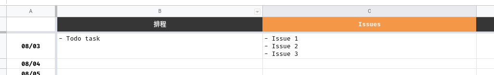

# daily-workpad
Custom daily workpad on google sheet

## Setup
- Copy Google spreadsheet from [template](https://docs.google.com/spreadsheets/d/19aCbwPRYF98fYupfDfdtUIzdOCQTId0SI1-rmxEMEHY/edit?usp=sharing)
- Sheet contents can be customized with self requirements
- Sheet should be named `YYYY/MM`, each sheet represent as one month

## Version 0.1.0
- Update function: Manually update each day's tasks

## Usage
- Fill todo tasks inside each catagory according to planned date
    - 
- Mark task as complete by changing text style to `strikethrough`
- Click `New Update` function in `workpad` menu to update remained tasks to next day
